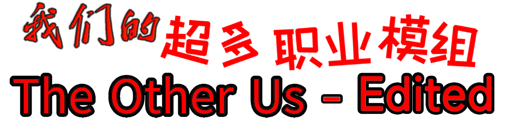

 <a href="README_EN.md"> English </a> 

    
    

本模组不隶属于 Among Us 或 Innersloth LLC，其包含的内容也未得到 Innersloth LLC 的认可或以其他方式赞助。此处包含的部分材料是Innersloth LLC的财产。

# The Other Us - Edited

若在游玩过程中发现了bug或有一些建议，欢迎提出ISSUE、PR或加入模组交流群 >>> <a href="https://qm.qq.com/q/MlhqY3QcYU">961341019</a>

职业相关Wiki请移步至我的个人博客 >>> <a href="https://www.mxyx.club/archives/theotherus">[沫夏悠轩の聚会 - 模组职业介绍]</a>

由于目前模组并不支持最新版本游戏，另附部分常见版本的<b>游戏本体</b>下载链接：<a href="https://www.123865.com/s/XD6SVv-KlL7v">123云盘</a>  <a href="https://mega.nz/folder/KBUFwSAb#cAHFey3e8lEeV75OhLmOeQ">MEGA云盘</a> 
如有特殊需求可以进群联系我

如果喜欢本模组请给仓库多点点star谢谢喵!

## 模组下载

| 游戏版本            | 模组版本 | 发布日期  | 链接                                                         |
| ------------------- | -------- | --------- | ------------------------------------------------------------ |
| 2024.8.13 ~ 2024.10.29 | v2.0 NEXT | 缓慢开发中...     |         |
| 2024.3.5 ~ 2024.6.4 | v1.1 | 2024.12.9 | [下载](https://github.com/mxyx-club/TheOtherUs-Edited/releases) |
| 2024.3.5 ~ 2024.6.4 | v1.0 | 2024.3.3 | \[古老版本已删除\] |

注：本模组只发布经过测试后的文件，其余仅为内测版本。

## 更新日志

详情请查看[Github releases](https://github.com/mxyx-club/TheOtherUs-Edited/releases)

## TOR游戏模式

- 经典模式
- 赌怪模式
- 轮抽选角
- 匿名模式

## 职业列表

|   内鬼阵营   |   中立阵营   |  船员阵营  |  附加能力  |  幽灵职业  |
| :----------: | :----------: | :--------: | :--------: | :--------: |
|    化形者    |    幸存者    |    侠客    |    恋人    | 灵魂工程师 |
|    狼之主    |    失忆者    |    市长    |    刺客    |   捣蛋鬼   |
|    入殓师    |    打工仔    |   检察官   |   分散者   |    怨灵    |
|   专业杀手   |   乐队主唱   |    警长    |  专业刺客  |    阻挠鬼   |
|    模仿者    |     小丑     |    捕快    |  迷乱旋涡  |            |
|    隐蔽者    |     律师     |   工程师   |   绝境者   |            |
|    管道工    |    处刑者    | 星门缔造者 |    诱饵    |            |
|    抹除者    |    起诉人    |    保镖    |    余波    |            |
|    吸血鬼    |     秃鹫     |    医生    |    火炬    |            |
|    清理者    |     魅魔     |    侦探    |   太阳镜   |            |
|    炸弹狂    |  末日预言家  |    牧师    |   溅血者   |            |
|    送葬者    |   身份窃贼   |    老兵    |   通讯兵   |            |
|    逃逸者    |    纵火狂    |   换票师   |   破平者   |            |
|     术士     |   月下狼人   |    黑客    |   闪电侠   |            |
|    骗术师    |     鹈鹕     |    灵媒    |   多线程   |            |
|   赏金猎人   |     天启     |   传送师   |    巨人    |            |
|   恐怖分子   |    隐身人    |   追踪者   |    小孩    |            |
|    勒索者    |     豺狼     |   告密者   |    Vip     |            |
|     女巫     |     跟班     |    卧底    |   不屈者   |            |
|     忍者     |   巴甫洛夫   |    保安    |    反骨    |            |
|    悠悠球    |  巴甫洛夫的狗 |   通灵师   | 管道工程师 |            |
| 邪恶的设陷师  |     感染者     |   设陷师   |   胆小鬼   |            |
|    肢解者    |   薛定谔的猫    |   预言家   |   窥视者   |            |
|     赌徒     |              |   情报师   |    雷达    |            |
|    掷弹兵    |              |   大神官   |   执钮人   |            |
|    快枪手    |              |   典狱长   |   变色龙   |            |
|    狂战士     |              |            |   交换师   |            |

## 错误报告

如预见游戏性Bug或者有更多的建议可以在仓库[issue](https://github.com/mxyx-club/TheOtherUs-Edited/issues/new/choose)提出，或加入模组交流群：[961341019](https://qm.qq.com/q/MlhqY3QcYU)

## 模组贡献者

### 主要开发者

[沫夏悠轩](https://github.com/mxyx0412)

### Github贡献者：

[天寸梦初](https://github.com/TianMengLucky)、[Imp11](https://github.com/dabao40)、[方块](https://github.com/FangkuaiYa)

### 美术组：

[方块](https://github.com/FangkuaiYa)、Det黎木、阿门の葡萄

### 翻译：

**ZH：** 沫夏悠轩、Conscience

**EN：** MamoruKun、九头蛇

### 其他贡献参考:

[OxygenFilter](https://github.com/NuclearPowered/Reactor.OxygenFilter) - For all the versions between v2.3.0 and v2.6.1, we were using the OxygenFilter for automatic deobfuscation\
[Reactor](https://github.com/NuclearPowered/Reactor) - The framework used for all versions before v2.0.0\
[BepInEx](https://github.com/BepInEx) - Used to hook to game functions\
[Essentials](https://github.com/DorCoMaNdO/Reactor-Essentials) - Custom game options by **DorCoMaNdO** :

- Before v1.6: We used the default Essentials release
- v1.6-v1.8: We slightly changed the default Essentials release. The changes can be found on this [branch](https://github.com/Eisbison/Reactor-Essentials/tree/feature/TheOtherRoles-Adaption) of our fork.
- v2.0.0 and later: We're no longer using Reactor anymore we are using our own implementation inspired by the one from **DorCoMaNdO**

[Jackal and Sidekick](https://www.twitch.tv/dhalucard) - Original idea for the Jackal and Sidekick came from **Dhalucard**\
[Among-Us-Love-Couple-Mod](https://github.com/Woodi-dev/Among-Us-Love-Couple-Mod) - Idea for the Lovers modifier came from **Woodi-dev**\
[Jester](https://github.com/Maartii/Jester) - Idea for the Jester role came from **Maartii**\
[ExtraRolesAmongUs](https://github.com/NotHunter101/ExtraRolesAmongUs) - Idea for the Engineer and Medic role came from **NotHunter101**. Also some code snippets from their implementation were used.\
[Among-Us-Sheriff-Mod](https://github.com/Woodi-dev/Among-Us-Sheriff-Mod) - Idea for the Sheriff role came from **Woodi-dev**\
[TooManyRolesMods](https://github.com/Hardel-DW/TooManyRolesMods) - Idea for the Detective and Time Master roles came from **Hardel-DW**. Also some code snippets from their implementation were used.\
[TownOfUs](https://github.com/slushiegoose/Town-Of-Us) - Idea for the Swapper, Shifter, Arsonist and a similar Mayor role came from **Slushiegoose**\
[Ottomated](https://twitter.com/ottomated_) - Idea for the Morphling, Snitch and Camouflager role came from **Ottomated**\
[Crowded-Mod](https://github.com/CrowdedMods/CrowdedMod) - Our implementation for 15+ player lobbies were inspired by the one from the **Crowded Mod Team**\
[Goose-Goose-Duck](https://store.steampowered.com/app/1568590/Goose_Goose_Duck) - Idea for the Vulture role came from **Slushiegoose**\
[TheEpicRoles](https://github.com/LaicosVK/TheEpicRoles) - Idea for the first kill shield (partly) and the tabbed option menu (fully + some code), by **LaicosVK** **DasMonschta** **Nova**\
[Ninja](#ninja), [Thief](#thief), [Lawyer](#lawyer) / [Pursuer](#pursuer), [Deputy](#deputy), [Portalmaker](#portalmaker), [Guesser Modifier](#guesser-modifier) - Idea: [K3ndo](https://github.com/K3ndoo) ; Developed by [Gendelo](https://github.com/gendelo3) & [Mallöris](https://github.com/Mallaris) \
[PropHunt](https://github.com/ugackMiner53/PropHunt) - Idea and core code by **ugackMiner53**\
[Cursed Among Us](https://github.com/XiezibanWrite/Cursed-Among-Us-Continued) - Idea by **Kyle Smith**, core code by [XiezibanWrite](https://github.com/XiezibanWrite/Cursed-Among-Us-Continued) and [SuperNewRoles](https://github.com/SuperNewRoles/SuperNewRoles)

## 许可

TheOtherRolesAU/TheOtherRoles is licensed under the[GNU General Public License v3.0](https://github.com/TheOtherRolesAU/TheOtherRoles/blob/main/LICENSE)Permissions of this strong copyleft license are conditioned on making available **complete source code of licensed works and modifications**, which include larger works using a licensed work, under the same license. Copyright and license notices must be preserved. Contributors provide an express grant of patent rights.
